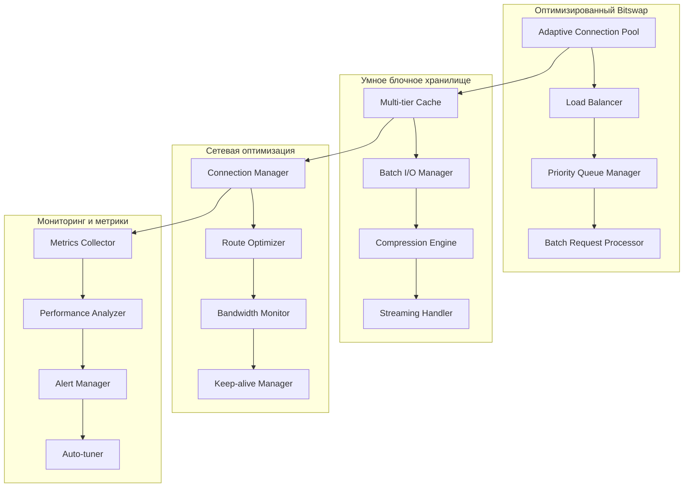

# Проект оптимизации Boxo для высокой нагрузки

## Обзор

Данный документ описывает архитектурные решения для оптимизации библиотеки Boxo под высокую нагрузку в составе IPFS-cluster. Проект направлен на повышение производительности ключевых компонентов: Bitswap, блочного хранилища, сетевого слоя и системы мониторинга.

## Архитектура

### Текущее состояние

Анализ кода показывает следующие текущие ограничения:
- `BitswapMaxOutstandingBytesPerPeer = 1 << 20` (1MB) - может быть недостаточно для высокой нагрузки
- `BitswapEngineBlockstoreWorkerCount = 128` - фиксированное количество воркеров
- `DefaultReproviderInterval = 22 часа` - может быть слишком долго для динамичных кластеров
- Отсутствие адаптивного управления ресурсами

### Целевая архитектура



## Компоненты и интерфейсы

### 1. Адаптивный Bitswap Engine

#### Интерфейс AdaptiveBitswapConfig
```go
type AdaptiveBitswapConfig struct {
    // Динамические лимиты
    MaxOutstandingBytesPerPeer int64  // Адаптивный лимит 1MB-100MB
    MinOutstandingBytesPerPeer int64  // Минимальный лимит 256KB
    
    // Пулы воркеров
    MinWorkerCount int // Минимум 128
    MaxWorkerCount int // Максимум 2048
    
    // Приоритизация
    HighPriorityThreshold time.Duration // 50ms
    CriticalPriorityThreshold time.Duration // 10ms
    
    // Батчинг
    BatchSize int // 100-1000 запросов
    BatchTimeout time.Duration // 10ms
}
```

#### Компонент PriorityRequestManager
- Классификация запросов по приоритету
- Динамическое распределение ресурсов
- Circuit breaker для защиты от перегрузки

### 2. Оптимизированное блочное хранилище

#### Интерфейс MultiTierBlockstore
```go
type MultiTierBlockstore interface {
    // Многоуровневое кэширование
    GetWithTier(ctx context.Context, cid cid.Cid, tier CacheTier) (blocks.Block, error)
    PutBatch(ctx context.Context, blocks []blocks.Block) error
    
    // Потоковая обработка
    GetStream(ctx context.Context, cid cid.Cid) (io.ReadCloser, error)
    PutStream(ctx context.Context, cid cid.Cid, data io.Reader) error
}

type CacheTier int
const (
    MemoryTier CacheTier = iota
    SSDTier
    HDDTier
)
```

#### Компонент BatchIOManager
- Группировка операций I/O
- Асинхронная запись с подтверждением
- Сжатие данных для экономии места

### 3. Сетевая оптимизация

#### Интерфейс AdaptiveConnManager
```go
type AdaptiveConnManager interface {
    // Адаптивные пулы соединений
    SetDynamicLimits(high, low int, gracePeriod time.Duration)
    
    // Мониторинг качества соединений
    GetConnectionQuality(peer peer.ID) ConnectionQuality
    
    // Автоматическое переключение маршрутов
    OptimizeRoutes(ctx context.Context) error
}

type ConnectionQuality struct {
    Latency time.Duration
    Bandwidth int64
    ErrorRate float64
    LastSeen time.Time
}
```

#### Компонент NetworkOptimizer
- Адаптивная настройка размеров буферов
- Обнаружение и обход медленных соединений
- Keep-alive управление

### 4. Система мониторинга

#### Интерфейс PerformanceMonitor
```go
type PerformanceMonitor interface {
    // Сбор метрик
    CollectMetrics() *PerformanceMetrics
    
    // Анализ производительности
    AnalyzeBottlenecks() []Bottleneck
    
    // Автоматическая настройка
    AutoTune(ctx context.Context) error
}

type PerformanceMetrics struct {
    BitswapMetrics    BitswapStats
    BlockstoreMetrics BlockstoreStats
    NetworkMetrics    NetworkStats
    ResourceMetrics   ResourceStats
}
```

## Модели данных

### Конфигурация производительности
```go
type HighLoadConfig struct {
    // Bitswap настройки
    Bitswap AdaptiveBitswapConfig
    
    // Блочное хранилище
    Blockstore BlockstoreConfig
    
    // Сетевые настройки
    Network NetworkConfig
    
    // Мониторинг
    Monitoring MonitoringConfig
}

type BlockstoreConfig struct {
    // Кэш настройки
    MemoryCacheSize int64 // 2GB по умолчанию
    SSDCacheSize    int64 // 50GB по умолчанию
    
    // Батчинг
    BatchSize    int           // 1000 блоков
    BatchTimeout time.Duration // 100ms
    
    // Сжатие
    CompressionEnabled bool
    CompressionLevel   int // 1-9
}

type NetworkConfig struct {
    // Менеджер соединений
    HighWater    int           // 2000
    LowWater     int           // 1000
    GracePeriod  time.Duration // 30s
    
    // Качество соединений
    LatencyThreshold    time.Duration // 200ms
    BandwidthThreshold  int64         // 1MB/s
    ErrorRateThreshold  float64       // 0.05 (5%)
    
    // Keep-alive
    KeepAliveInterval time.Duration // 30s
    KeepAliveTimeout  time.Duration // 10s
}
```

### Метрики производительности
```go
type BitswapStats struct {
    RequestsPerSecond     float64
    AverageResponseTime   time.Duration
    P95ResponseTime       time.Duration
    OutstandingRequests   int64
    ActiveConnections     int
    QueuedRequests        int64
}

type BlockstoreStats struct {
    CacheHitRate          float64
    AverageReadLatency    time.Duration
    AverageWriteLatency   time.Duration
    BatchOperationsPerSec float64
    CompressionRatio      float64
}

type NetworkStats struct {
    ActiveConnections     int
    ConnectionQuality     map[peer.ID]ConnectionQuality
    TotalBandwidth        int64
    AverageLatency        time.Duration
    PacketLossRate        float64
}
```

## Обработка ошибок

### Стратегии отказоустойчивости

1. **Circuit Breaker Pattern**
   - Автоматическое отключение проблемных компонентов
   - Постепенное восстановление нагрузки
   - Мониторинг состояния здоровья

2. **Graceful Degradation**
   - Снижение качества сервиса при перегрузке
   - Приоритизация критически важных операций
   - Автоматическое масштабирование ресурсов

3. **Retry Mechanisms**
   - Экспоненциальная задержка повторов
   - Джиттер для избежания thundering herd
   - Максимальное количество попыток

### Обработка специфических ошибок

```go
type ErrorHandler interface {
    HandleBitswapError(err error, peer peer.ID) error
    HandleBlockstoreError(err error, cid cid.Cid) error
    HandleNetworkError(err error, conn network.Conn) error
}

// Типы ошибок
var (
    ErrHighLatency     = errors.New("connection latency too high")
    ErrBandwidthLimit  = errors.New("bandwidth limit exceeded")
    ErrMemoryPressure  = errors.New("memory pressure detected")
    ErrDiskSpaceLow    = errors.New("disk space running low")
)
```

## Стратегия тестирования

### 1. Нагрузочное тестирование
- Симуляция 10,000+ одновременных соединений
- Тестирование пиковых нагрузок (100,000 запросов/сек)
- Длительные тесты стабильности (24+ часа)

### 2. Интеграционное тестирование
- Тестирование в кластерной среде
- Проверка взаимодействия компонентов
- Валидация метрик и алертов

### 3. Тестирование отказоустойчивости
- Симуляция сбоев сети
- Тестирование восстановления после сбоев
- Проверка circuit breaker логики

### 4. Бенчмарки производительности
```go
func BenchmarkBitswapHighLoad(b *testing.B) {
    // Тест производительности Bitswap под нагрузкой
}

func BenchmarkBlockstoreBatchOperations(b *testing.B) {
    // Тест батчевых операций блочного хранилища
}

func BenchmarkNetworkOptimization(b *testing.B) {
    // Тест сетевых оптимизаций
}
```

### Критерии производительности
- Время отклика < 100ms для 95% запросов
- Пропускная способность > 10,000 запросов/сек
- Использование памяти стабильно в течение 24+ часов
- CPU утилизация < 80% при пиковой нагрузке
- Сетевая латентность < 50ms между узлами кластера